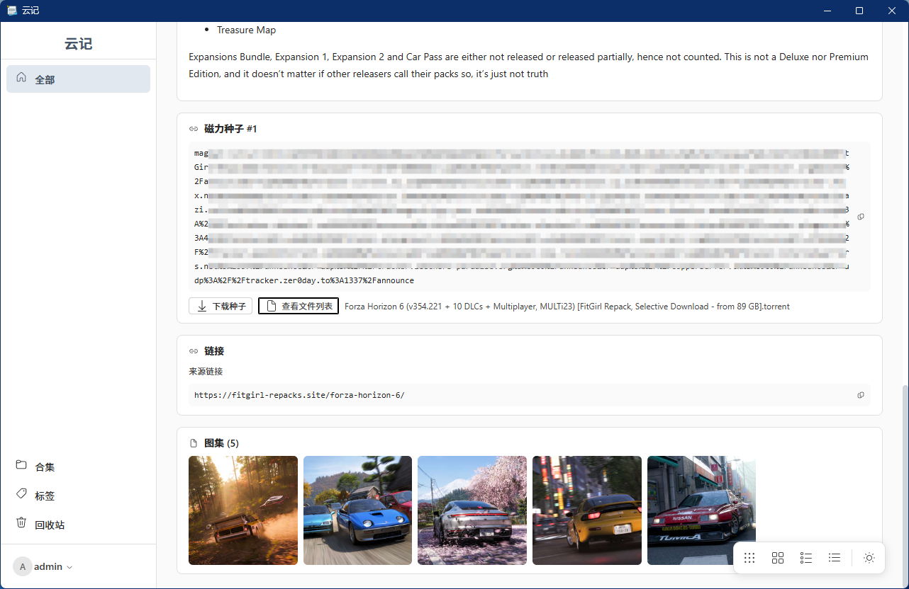

# 云记

基于 Tauri 2 + React 的本地资源管理应用，用于记录和管理游戏、影视等资源的标题、封面、图集、简介及下载链接（磁力/电驴/直链）。

## 此项目完全由teleagent人工智能完成

- 邀请链接注册或者填写邀请码 **8KZLAG** 可以额外获得3000点积分
- [https://agent.teleai.com.cn/s/3Z7DF9XWJC](https://agent.teleai.com.cn/s/3Z7DF9XWJC)

## 功能特性

- **资源管理**：标题、封面、图集、正文简介、附件链接（磁力 / 电驴 / 直链 / 普通文件）
- **分类与组织**：分类树、合集、标签，支持回收站
- **网页采集**：内置 FitGirl Repacks 采集插件，粘贴详情页链接即可一键提取标题、封面、图集、磁力链接和游戏简介并回填（插件化，可扩展）
- **Markdown 正文**：内置 Vditor 编辑器，支持正文图片/文件上传
- **种子转磁力**：上传 .torrent 自动反推磁力链接
- **权限系统**：用户注册登录、文章/管理权限分级
- **多视图**：卡片 / 紧凑 / 列表视图切换，明暗主题

## 截图

列表页：


编辑/采集页：



## 技术栈

| 层 | 技术 |
|----|------|
| 前端 | React 19 + TypeScript + Fluent UI v9 + react-router + @tanstack/react-query + zustand + Vditor |
| 后端 | Rust + Tauri 2 + sqlx + SQLite |
| 构建 | Vite |
| 下载工具 | aria2c（磁力链接下载） |

## 开发

```bash
npm install
npm run tauri dev
```

> 注意：请使用 `npm run tauri dev` 启动的桌面窗口，不要用浏览器直接访问 5173（无后端数据）。

## 构建发布

```bash
npm run tauri build -- --no-bundle
```

或使用仓库内的 `git.bat` → `R`（Build and release）一键构建并发布到 GitHub Releases（需本地 Git 凭证已配置）。

## 目录结构

```
yunji-tauri/
├── src/                  # 前端 React 代码
├── src-tauri/            # Rust 后端
│   ├── src/commands/     # Tauri 命令（资源、采集、清理等）
│   ├── src/db/           # 数据库与仓储
│   ├── resources/        # 内置采集插件
│   └── data/             # 运行时数据库与上传文件（gitignored）
└── 截图/                  # README 用截图
```
